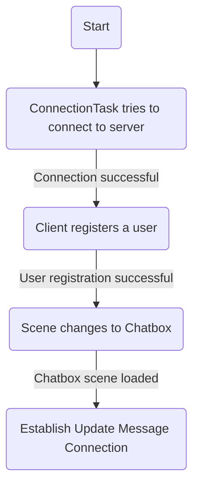

<p align="center">
  
</p>
Voxx is a desktop/command-line non-persistent drop in public chat channel, where users can chat with other connected users with a degree of anonymity. Users could also host their own Voxx server to setup a communication medium for their own use cases.

## Goals

Since Voxx is a simple chat application we only need few simple goals as well.

- [x] **Multi-Client Server**: It is critical that the server is able to serve and handle multiple clients that connects to the server.
- [x] **Reliable Connection**: The connection between the client and the server needs to be stable and all of the features like sending messages and getting updates must still work until the client disconnects from the sever.
- [x] **Robust Cominication Protocol**: The communication between the server and the client must be straight forward and easy to understand.
- [x] **Deployable Clients**: Voxx clients that's easy to install for the end user/clients.
- [x] **Deployable Server:** Make it easy for users to be able to start their own voxx server for their own use case.

## Use cases

- **Anonymous support groups**: Voxx can be used as a platform for anonymous support groups where people can connect with others who are going through similar struggles. The fact that messages are not logged or saved can create a sense of
  privacy and safety for users.
  
- **Event-based chat**: Voxx can be used as a platform for event-based chat channels where people can connect and chat with others who are attending the same event. For example, people attending a conference, music festival, or sporting event can use Voxx to chat with each other.
  
- **Study groups:** Voxx can be used as a platform for study groups where students can connect and chat with each other about their coursework. The fact that messages are not logged or saved can create a sense of privacy and security for students who may be concerned about their academic performance.
  
- **Gaming communities**: Voxx can be used as a platform for gaming communities where players can connect and chat with each other about their favorite games. The fact that messages are not logged or saved can create a sense of privacy and security for players who may be concerned about their online reputation.
  
- **Language exchange**: Voxx can be used as a platform for language exchange where people can connect with others who are looking to practice speaking a different language. The fact that messages are not logged or saved can create a sense of privacy and safety for users who may be hesitant to speak in a new language with strangers.

These are just a few potential use cases for Voxx. With some creative thinking, you can likely come up with many more!

## Protocol

This documentation specifies what the server for Project-Voxx is going to accept with its corresponding response and messages that a server could send. Therefore, a client needs to anticipate non-requested messages from the server.

#### Server-Client Communication Overview

At its core, Project-Voxx protocol is going to be transported through `websocket`. The communication is text based, therefore, all the message received and sent by the message is going to be a `String`. To have a clear and easy to parse message, we’ve opted into using the `json` syntax for our messages. However, the `json` syntax needs to be flattened and `must not have any break line`. Use the following regex replacement on your `json` string before sending requests to the server:

**Java**

```java
"<your jason string here>".replaceAll("\\s{2,}|\\n","");
```

**Python**

```python
import re

re.sub(r'\s{2,}|\n', '', "<your jason string here>")
```

#### Server Connection

When a client connects to the server, the connection is not affiliated with any user until the client socket sends a request `ru` or `register user` to the server. If the user with the same username is not registered in the server, the socket connection will be bound to that user and every request from or to the client is in the context of that user.

Once a socket client registers a user, we now have an established `Response-Request` connection to the server. However, there's another optional connection that you can establish which is called the `Update Message` connection.

##### Response-Request Connection

This connection from the client handles all of the request that's coming in from the it to the server. This connection is essentially a blocking connection where a client sends a request to the server and will wait for a response. *<u>If you're implementing you're own client, you may want to set a socket timeout.</u>*

##### Update Message Connection

The update message connection is a supplemental connection that a client sets up to receive update messages from the server. This connection must be setup correctly and a `Response-Request` connection must be established before this connection is setup. Specification for setting up this connection could be found under the heading [Update Message](#update-message)

### Request format

Before we can list down all the valid request that a client can make to the server, let’s talk about the format of a request. The format of a request is pretty straight forward and looks like the following:

```json
{
  "request-id": "request key",
  "params": {
    "param-1": "Some parameter 1",
    "param-2": "Some parameter 2"
  }
}
```

As we can see, the format is in the `json` syntax. This makes it so that we can serialize and deserialize an object through a `websocket` easily. The attribute named `request-id` is the name of the request that we are making to the server. Depending on the parameters that the request accepts, we need to provide the right amount of parameter that goes with that request, and we must put them in the attribute `params` and attribute params must match the attribute name defined in the request documentation.

For undefined requests the server is going to respond with the following message:

```json
{
  "response-id": -1,
  "body": {
    "message": "{request-id} is not a valid request"
  }
}
```

We can see that the `response-id` is `-1` meaning that the request does not exist. And a body attribute with a `message`.

For valid requests, each request type will have their own unique response, and they will be specified below.

### Requests

The following headers will show specifications of each request.

##### Register User

Here is the request body that you must send to the server to have a valid register user request

```json
{
  "request-id": "ru",
  "params": {
    "uname": "{username}"
  }
}
```

Since Project-Voxx is a non-persistent drop in public chat channel, user do not need a password. The only requirement for user registration is a username and that it’s not taken by any other users in the live server.

If the client socket sends a request with a username that’s already taken the server will respond with the following:

```json
{
  "response-id": 0,
  "body": {
    "message": "{request username} is already taken"
  }
}
```

A response ID `0` means that the request is invalid due to improper parameters or unsatisfied requirements.

If the user registration is successful, the server will respond with the `UID` for the user. A UID is a unique identifier that could be associated with a user or a message. Since the UID contains the timestamp, it allows us to sort users based on when they registered to the server. The following is an example of a successful user registration:

```json
{
  "response-id": 1,
  "body": {
    "user": {
      "uid": 6884583347257344,
      "uname": "{username}"
    }
  }
}
```

##### Sending a Chat Message

When sending a message to the server, the client socket must have a bound `user` first. Therefore, the client socket must request an `ru` (register user) first. With that being said, here’s an example request for sending a message:

```json
{
  "request-id": "sm",
  "params": {
    "message": "{message}"
  }
}
```

However, nothing can stop a client form sending a send message request even without sending a user registration request first. If this is the case, the server will respond with the following invalid request response:

```json
{
  "response-id": 0,
  "body": {
    "message": "User registration is required before sending a message!"
  }
}
```

When a chat message request was handled properly the server should respond with the following message:

```json
{
  "response-id": 1,
  "body": {
    "message": {
      "uid": 6884583351369728,
      "content": "{message sent}"
    }
  }
}
```

##### Getting User List

A request that the client can make to get all the registered user in the server.

The request body for getting the user list is super simple and does not require any parameter:

```json
{
  "request-id": "ul"
}
```

Since this request does not require any parameter/argument, the response will always be a `1`. And here's an example of a possible response from the server:

```json
{
  "response-id": 1,
  "body": {
    "users": [
      {
        "uid": 6884583351369729,
        "uname": "{username1}"
      },
      {
        "uid": 6884583351373824,
        "uname": "{username2}"
      },
      {
        "uid": 6884583355506688,
        "uname": "{username3}"
      },
      {
        "uid": 6884583355506689,
        "uname": "{username4}"
      },
      {
        "uid": 6884583355510784,
        "uname": "{username5}"
      },
      {
        "uid": 6884583359643648,
        "uname": "{username6}"
      }
    ]
  }
}
```

As you can see, the response body has one attribute named `users` that contains a `json` array of users. If there is no user in the server, the array will be an empty array.

### Update Message

Update messages are messages that are sent by the server to the clients to update clients about changes that happens in the server. This is for when a user sends a chat message to the server, a new user registers, or when a user disconnects. The client can do whatever they want to do with the update messages, but they’re there so that the clients can display up-to-date information from the server. 

Before the client can establish a proper `Update-Message` connection. The `Response-Request` **must be established first and have a registered user**. Once established, we need to make another socket connection to connect to the server to serve as an `Update-Message` connection. It is also important to note that this new socket connection **needs to send keep alive messages**. The keep alive configuration is flexible as long as it is sending it. To set up this new keep alive connection as an `Update-Message` connection, we must send the following request using this new socket connection **not the response-request** connection:

```json
{
	"request-id": "su", 
	"params": {
		"main-user": "<main-username>"
	}
}
```

As you can see, this request needs a `main-username` as a parameter. This is why the `Response-Request` needs to be established first and a user needs to be registered (which returns the generated user). 

When this request is sent and the main user exists, this connection will be set as a `supplemental` connection of the `Response-Request` connection and the server will send update messages to it.

#### Messages

The following are the messages that a client must anticipate from the server.

##### New User Update Message

This update message is sent to each of the client when a new user is registered so that clients can update their user list (if being tracked). Here’s what the update message looks:

```json
{
  "update-message": "nu",
  "body": {
    "user": {
      "uid": 6884583359643649,
      "uname": "{username}"
    }
  }
}
```

##### New Chat Update Message

This is sent by the server to all the clients when a user sends a new chat message. This excludes the sender of the message.

```json
{
  "update-message": "nm",
  "body": {
    "sender": {
      "uid": 6884583359643650,
      "uname": "{sender username}"
    },
    "message": {
      "uid": 6884583363784704,
      "content": "{some message}"
    }
  }
}
```

##### User Disconnect Update Message

This update message is sent by the server when a user (client) disconnects from the server.

```json
{
  "update-message": "ud",
  "body": {
    "user": {
      "uid": 6884583363784705,
      "uname": "{username}"
    }
  }
}
```

## System/App Class Design

Voxx is managed using `Gradle` and is subdivided into three modules: `voxx-commons`, `voxx-client`, and `voxx-server`. The module names are pretty self-explanatory, `voxx-commons` contains code that both the client and the server would use. The module `voxx-client` will contain the code for the client. And lastly, the `voxx-server` module contains the code for the server. However, on top of these three modules, there’s another “module” (it’s really a python package) that is a git submodule where the python client is hosted and it’s called `voxx-client-cli` since this is a command line interface client for Voxx.

### Voxx Commons

As briefly mentioned before. This module contains all of the code that is going to be used throughout the whole project. However, the socket abstraction layer is mainly used in the `voxx-server` module.

This module contains three main modules, `esal`, `model`, and `protocol`

#### Abstraction Layer (esal)

ESAL or **E**than’s web**s**ocket **a**bstraction **l**ayer is a package that makes implementing the Voxx server easier. This was achieved by implementing an event based socket server. But before we can have an event based system, an event bus is needed.

##### Event Bus

The event bus for the abstraction layer is annotation based, and the annotation’s retention policy is set for runtime, therefore the event bus relies on the [Reflection API](https://docs.oracle.com/javase/tutorial/reflect/index.html). Moreover, the event bus is also multi-threaded to make listener invocations non-blocking (which we need to pay attention to for when we make our listeners).

At it’s core, the design of the event bus is pretty straight forward. When we construct an event bus, we can immediately subscribe listeners as demonstrated here:

```java
// An event could be any class.
class SomeEvent { ... }

class SomeEvent2 { ... }

class SomeListeners implements EventBus.Listener {
    
   	@EventListener
    private void onSomeEvent(SomeEvent event) {
        System.out.println("SomeEvent happened!")
    }
    
   	@EventListener
    private void onSomeEvent2(SomeEvent2 event) {
        System.out.println("SomeEvent2 happened!")
    }
    
    public static void main(String[] args) {
        EventBus bus = new EventBus();
        bus.subscribeListeners(new SomeListeners()) // <--- Listener subscription here
    }
}
```

The `EventBus#subscribeListener(EventBus.Listener listener)` method will reflectively iterate through all of the declared methods inside of that `Listener` class and will extract [Methods](https://docs.oracle.com/javase/8/docs/api/java/lang/reflect/Method.html) that are annotated with `@EventListener`. It is important to note that we actually construct the listener class because we need to store it in the `ListenerMethod` class so that we can successfully pass it to the method invocation later via reflection api.

We can now look at how to `post` an event so that we could invoke listener methods. Here’s a demo on how to post the events define above and a corresponding output:

```java
public static void main(String[] args) {
	EventBus bus = new EventBus();
    bus.subscribeListeners(new SomeListeners()) // <--- Listener subscription here
        
    bus.post(new SomeEvent()); // <--- Post with no runnable that runs after.
    System.out.println();
    bust.post(new SomeEvent2(), () -> System.out.println("Done posting SomeEvent2")); // <--- Post with runnable  
}
```

Output:

```
SomeEvent happened!

SomeEvent2 happened!
Done posting SomeEvent2
```

Now that we have a fully working event bus, we implemented the following events, `ClientConnectEvent`, `ClientDisconnectEvent`, and `ClientMessageEvent` that we need to post when implement the abstraction layer for the server.

##### Server Abstraction Layer

This implementation is very similar on how we implemented the server socket in class where we have a main thread that waits for connections and construct client workers (called `ClientConnection`) and run on a different thread. The only difference is that we take advantage of the `EventBus` so that whenever a new connection is accepted and a `ClientConnection` is constructed, we post a `ClientConnectEvent` with the matching `ClientConnection`.

```java
var clientConnection = new ClientConnection(clientSocket, this); // "this" is the Server instance
LOGGER.info(String.format("New client (%s)", clientConnection.getRemoteAddress()));
eventBus.post(new ClientConnectEvent(clientConnection), () -> clientConnections.add(clientConnection));
```

Once posted, we then execute this `ClientConnection` on a different thread.

###### ClientConnection

This is also implement very similarly to how we implemented a client worker in class. But as we mentioned before, instead of the abstraction layer handling incoming message. We will pass down that responsibility to the listener of the `ClientMessageEvent` by posting this event and passing the message.

```java
try {
    String inLine;
    while ((inLine = in.readLine()) != null && isConnected())
        eventBus.post(new ClientMessageEvent(this, inLine)); // <--- instance of ClientMessageEvent and the line
    close();
} catch (IOException e) {
	Server.LOGGER.error(e.getMessage());
	close();
}
```

On top of posting the `ClientMessageEvent` we can also see that we are calling the `close` function when we exit the while loop or caught an exception. The `close()` function essentially closes the client socket and the in/out stream. Once closed, we post a `ClientDisconnect` Event.
```java
public void close() {
    try {
        if (!clientSocket.isClosed()) {
            in.close();
            out.close();
            clientSocket.close();
            serverInstance.getClientConnections().remove(this);
            eventBus.post(new ClientDisconnectEvent(this));
            isRunning = false;
        }
    } catch (IOException e) {
    	Server.LOGGER.error("Could not properly close connection! " + e.getMessage());
    }
}
```

The information above is everything in the `esal` package and we will see how this is used when we get to the [Voxx Server](#voxx-server) header.

#### Model (model)

This package contains “plain old java objects” `Message`, `User`, and`UID`.  The first two objects are trivial objects, however, I want to focus on the UID because it’s is not that plain and it contains very useful properties.

##### UID

UID or uniquely identifiable descriptors are essentially just a unique id that a `Message` and a `User` is assigned with to make sure that they are unique. This is done by implementing a similar system to [Snowflake ID](https://en.wikipedia.org/wiki/Snowflake_ID). But the main difference is that instead of using 64 bits, we are only using 54 and it is broken down like the following:

```
111111111111111111111111111111111111111111  111111111111
54                                       12            0
```

| Field          | Bits  | Description                                                  | Retrieval           |
| -------------- | ----- | ------------------------------------------------------------ | ------------------- |
| Timestamp      | 12-53 | Millisecond since Epoch (Could be any  arbitrary epoch that we chose) | (uid >> 12) + epoch |
| Incremental ID | 0-11  | If multiple creation request happens in  the same timeline we increment this | uid & 0xFFF         |

The chosen epoch for the UID implementation is:  `TIME_EPOCH = 0x64b62a60`

On top of this UID class, we also have an inner `Generator` class (factory class). It’s a thread safe UID generator and will always produce a unique UID.

###### UID Property

- Since the UID contains a timestamp, that means we can take advantage of that information to show timestamps on our messages. Therefore the UID class also comes with other utility functions that automatically convert that timestamp to local date time and format them.

- A UID is also easily transportable because it’s essentially just a binary data that you can convert to a number `long` for this instance.
- There is no data persistence in Voxx but if there is, we can easily store objects in a database using UID. Which is the main motivator on developing the `Snowflake ID`

#### Protocol (protocol)

This package does not contain significant code since the protocol is outside of the scope of the commons/abstraction layer. Therefore the source code for the protocol defined above is implemented in the module `voxx-server`. However this package contains two things, the interface for `Request` and `ProtocolUtil`

- ProtocolUtil
  - This class essentially just contains a static helper function that takes in JSON objects and returns it as a flattened string, ready to be sent to the server/client.
- Request
  - This is just an interface for a request that contains a function that implementors must implement to be considered as a Request.

### Voxx Servers

This module is where the server for Voxx is actually implemented. Since we’ve made is so that the Server is actually event based, at it’s core, the server implementation is actually pretty simple and it can be broken down like the following.
```java
public class VoxxServer extends Server implements EventBus.Listener {
	
    public VoxxServer() {
        // .... constructor code here.
        getEventBus().subscribeListeners(this);
    }
    
    @EventListener
    public void onClientConnect(ClientConnectEvent event) {
        // ... Code when a client connects.
    }
    
    @EventListener
    public void onClientMessage(ClientMessageEvent event) {
        // ... Code when a client sends a message
    }
    
	@EventListener
    public void onClientDisconnect(ClientDisconnectEvent event) {
        // ... Code when a client disconnects
    }
}
```

However, before we dive down on how Voxx-server is using these events, we first need a few objects that would help us. Let’s start with the `UserRegistry`.

##### User Registry 

The user registry contains a concurrent hashmap (ConcurrentHashMap<String, User>) that stores the user object using the username as a key. Since we don’t want to immediately register clients as a user, this class is not used until the socket client successfully sends a [Register User Request](#register-user). The main purpose of this class is to contain registered users and will be used to later for when a client sends a [Get Users](#getting-user-list). To handle these request we heed a handler and we’ll call this `ProtocolHandler`

##### ProtocolHandler

The protocol handler contains an inner class called `RequestParser` that parses incoming message. This parser will try to parse the message as Json object and see if it would throw a JSONException, indicating that the message does not have a Json syntax. If it is, this parser will then look at the json attribute called “request-id” and find a matching ID that exist in the `RequestEnum` and reflectively construct and return that `Request`. 

The ProtocolHandler also consist a function called `handleOnMessage(ClientMessageEvent event)` that would be called inside the event listener that we have above. With the request parser this is what that function looks like:

```java
public void handOnMessage(ClientMessageEvent event) {
    var req = RequestParser.parse(event, serverInstance);
    if (Objects.nonNull(req))
    	req.onRequest(event);
}
```

Now that we’ve defined objects that we need. Let’s now talk about how Voxx-server handles each events above.

#### On Client Connect

Since the client needs to send a register request before they could be added in the `UserRegistry` , the ClientMessageEvent does not really do anything other than logging that a new client connected to the server. 

It is also important to note that this type of ClientConnection is still not set at this point. So we must wait if this connection is going to be set as a [Response-Request Connection](#response-request-connection) or an [Update Message Connection](#update-message-connection)

#### On Message

On this event, we are going to use the `handleOnMessage` function that could be found in the `ProtocolHandler`. This should automatically parse the message and construct the matching request and call the `onRequest` function that a request needs to implement.

```java
@EventListener
public void onClientMessage(ClientMessageEvent event) {
	// ... code
	
    var msg = event.getMessage();
    Server.LOGGER.info("[Vox] Client said: " + msg);
    protocolHandler.handOnMessage(event);
}
```

#### On Client Disconnect

At this point, on the abstraction layer, the client is already disconnected. Therefore, we really can’t do anything socket wise. So when Voxx gets this event, it does the following:

- Checks if this client connection that disconnected was a supplemental connection or does not have an associated user.
  - If it doesn’t, we don’t need to do anything, so return and short the function.
- Get the associated user for that client connection and remove the user from the `UserRegistry`
- Broadcast that the client with the user info disconnected.

### Voxx Client

This module contains the JavaFX client for Voxx.

#### User Interface

For Project Voxx Java client, we have two main scenes: `Login scene` and `Chatbox scene`

<p align="center">
  
  
</p>


To allow us to switch scenes with ease, we also implemented a utility class called `PrimaryStageManager` that contains a function called `#setScene(String fxml, Consumer<T> controllerConsumer)`. This function allows you to pass in a consumer where the instance of the controller is passed just in case you have to call functions of the controller when the fxml is loaded.

#### Controllers

Currently, the Voxx java client connection is implemented using the classes `ChatController` and `LoginController`. 

###### Login Controller

`LoginController` is responsible for controlling the login screen of the application. When the scene is loaded , and the controller is initialized, it will construct the `ConnectionTask` and run it on a different thread. By default, Voxx will try to connect to the server with the address `localhost` and port `8008` (_which is the voxx-server running on local machine_). If there is no voxx-server running on localhost, the connection indicator will turn red. To connect to a different server, you can click the red dot and provide the server address and port using the following format: `server_addres:port`. The controller will now then try to connect to that new server.

Once connected, we now need to register a new user. To do so, we need to provide a username and click the `Start Chatting` button. It will check if the username that is entered is valid. We have designated a valid username to be between 4-7 characters, also allowing for numbers and underscores, however the username cannot start with numbers first. It then sends a request to the server to create a new user with the entered username. If the request is successful, the controller will now call `#setScene()` in the `PrimaryStageManager` to change the scene to the `Chatbox` scene.

###### Chat Controller

`ChatController` is responsible for controlling the user-interface experience of the application. It handles the display and sending of messages, updating user lists, and connecting to the server to receive updates.

#### Connection

Currently, the Voxx java client connection is implemented utilizing the class `ReqResClientConnection` and, optionally, `UpdateMessageConnection`.

###### Request-Response Connection

The implementation of the `ReqResClientConnection` follows the documentation above when it comes to the `Request-Response` connection. Therefore any request sent from this connection type will be blocking and will always wait for response from the server. 

###### Update Message Connection

Like the `Response-Reques` connection, this connection type was also implemented by following the documentation about the Update message connection under the [Protocol](#protocol) hearder.

###### ConnectionTask

On top of the two connection implementation above, we also wrote a JavaFX task that would try connection to the server with `n` number of times. By default, this will try connecting to the defined address 3 times.

###### Connection flow



### Voxx Client CLI

Voxx CLI is a command line interface client for Voxx, it's written in python and has its own repo and added as a git sub module for the main Voxx repository.

Voxx CLI initially starts as a pure CLI application when connection has not been established yet. But as soon as the connection is established a valid user is registered, the CLI runs a text user interface (TUI) using the library `Textual`.

#### Modules

For Voxx cli, we have 4 modules. One of them is the main module which called `voxx` and inside of that module we have `connections`, `model` and `tui`.

##### voxx module

The voxx module is actually not really a python file but it's just a directory with `__init__.py`  and `__main__.py` in it. This package/module also contains the other modules. However, under this header we'll just talk about the double underscore (dunder) files for now.

###### `__init.py__`

This file effectively makes it so that this package/directory is considered a module. This file also contains meta data like the app name, version, author, and description, that we're going to use for `setuptool` when we install or build distribution for the python application.

###### `__main__.py`

This is essentially considered to be the main file for the module. It esssentially works as a main method for the module but inside of this file we also have a standard `if __name__ == __main__:` condition. This file is also the entry point of our cli application and setuptool is directed to make a script for it.

Because this is our entry point, this is also where we initialized 
