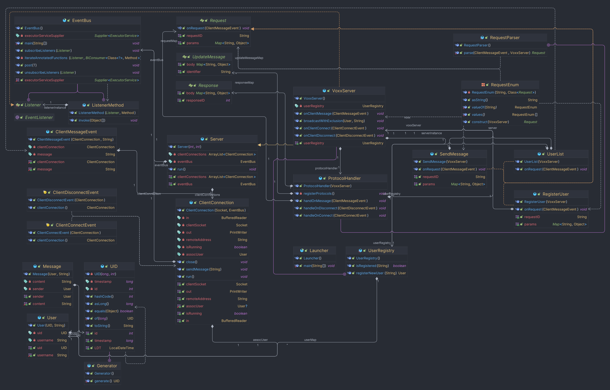
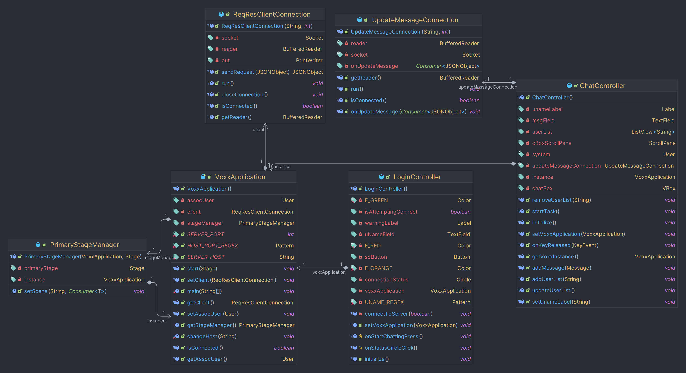

# Project Report: 2

Since the last report, we’ve been implementing the Java client and we now have a working JavaFX application (scenes are built using `SceneBuilder`)

### User Interface

For Project Voxx Java client, we have two main scenes: `Login scene` and `Chatbox scene`


To allow us to switch scenes with ease, we also implemented a utility class called `PrimaryStageManager` that contains a function called `#setScene(String fxml, Consumer<T> controllerConsumer)`. This function allows you to pass in a consumer where the instance of the controller is passed just in case you have to call functions of the controller when the fxml is loaded.

### Controller Overview

Currently, the Voxx java client connection is implemented using the classes `ChatController` and `LoginController`. 

#### Login Controller

`LoginController` is responsible for controlling the login screen of the application. When the scene is loaded , and the controller is initialized, it will construct the `ConnectionTask` and run it on a different thread. By default, Voxx will try to connect to the server with the address `localhost` and port `8008` (_which is the voxx-server running on local machine_). If there is no voxx-server running on localhost, the connection indicator will turn red. To connect to a different server, you can click the red dot and provide the server address and port using the following format: `server_addres:port`. The controller will now then try to connect to that new server.

Once connected, we now need to register a new user. To do so, we need to provide a username and click the `Start Chatting` button. It will check if the username that is entered is valid. We have designated a valid username to be between 4-7 characters, also allowing for numbers and underscores, however the username cannot start with numbers first. It then sends a request to the server to create a new user with the entered username. If the request is successful, the controller will now call `#setScene()` in the `PrimaryStageManager` to change the scene to the `Chatbox` scene.

#### Chat Controller

`ChatController` is responsible for controlling the user-interface experience of the application. It handles the display and sending of messages, updating user lists, and connecting to the server to receive updates.

### Connection Overview

Currently, the Voxx java client connection is implemented utilizing the class `ReqResClientConnection` and, optionally, `UpdateMessageConnection`.

#### Request-Response Connection

`ReqResClientConnection` is the main socket connection to the server. This connection allows us to do a synchronous request-response type communication with the server. Sent and received messages are essentially a flatten JSON string but is represented with a `JSONObjects` in the client code.

#### Update Message Connection

`UpdateMessageConnection` is used as a supplementary connection to the server. It is one way connection from the server (server->client) that listens to broadcasted update message from the server. 

The client connects to the server via a TCP socket, where it then listens for incoming message from the server. This connection is implemented using a while loop that listens persistently, where as stated above, allows for the client to be updated on changes happening in the server such as a list of current users in the server and when a user leaves the server. `UpdateMessageConnection` implements `Runnable`, which executes as a separate thread and allows for the client to receive updates.

When the `run()` method is called, the client enters a loop and reads messages from the server using object `BufferedReader`. In instances where new messages arrive, it is parsed as a `json` object.

### Trying Voxx

_Disclaimer: This project is still in development and there are still some issues that might arise when trying out Voxx_

A Voxx-server is currently running on `repo.cyr1en.com:8008`. All we need now is the Java client and connect to that server.

#### Building Voxx-Client

First of all, if you’re reading this, that means you have access to the Voxx repo. So the first step is to clone the repo to your local machine. Once done, follow one of the steps below to build the client depending on your preference.

##### Building executable

This is a platform dependent executable for Voxx and will not open up a console. There is also an optional argument `-PskipInstaller` if you want to skip package Voxx to an installer (Only for Windows for now).

To build the executable

```
./gradlew clean :voxx-client:jpackage -PskipInstaller=true
```

This will build an executable that could be found in `Project-Voxx/voxx-client/build/jpackage/Voxx`

##### Building distributable

This is the distributable build for Voxx and does not contain any executables (other than the launchers).

To build distributable

```
./gradlew clean :voxx-client:build
```

This will produce a distributable `zip` file located in `Project-Voxx/voxx-client/build`. Unzip the file, go to   `bin` and use the corresponding launcher for your OS. 

##### Running your own server

A server build is available here: [repo.cyr1en.com](https://repo.cyr1en.com/#/snapshots/com/cyr1en/voxx-server)

To run the server
```
java -jar -voxx-server-{version}.jar
```


### Previous Issues/Changes Made Since PR1

The `UID#asLong()` method was providing a timestamp that was a day ahead of the actual timestamp of when the UID was generate. This was corrected by subtracting our set TIME_EPOCH.

#### Protocol change for sending a chat message:

The prefix `message` for uid and content on the json object `message` as listed in PR1 was determined to be redundant, so it was removed. The protocol listed above for sending a chat message reflects what is current.

#### Protocol change for update-message:

The key for update-message was changed to nm, previously ns, for clarity and ease of understanding, where:

**nm = new message**

**nu = new user**

**ud = user disconnect**

### Current issues:

Currently, there is a problem with the disconnect if the application is closed prematurely.

In instances where this occurs, the client does not disconnect. To resolve this issue, we may add a check on the server to verify if a client is still connected, and if not, remove automatically.

### UML Diagram

The following image contains the UML diagram of all the implemented code that we have so far. The server UML has not changed, however we have added the client UML diagram:

Commons-Server UML Diagram:

Client UML Diagram:

